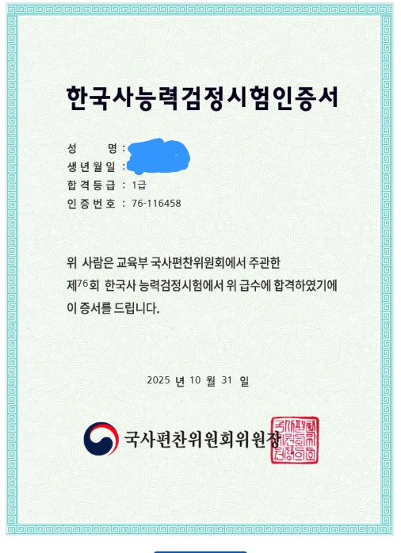

# 76회 한능검 1급 후기

1급 취득했다 ㄱㅇㄷ

2025년... 마지막 한능검 시험을 치룬 이후 후기이다.
시험을 치게 된 계기는 별거 없이 공기업 준비 겸 봤는데 거의 대부분의 공기업에서 신분증마냥 1급을 요구하기 때문에 1급을 목표로 달렸다.

준비기간은 넉넉잡아 1달을 잡고 공부했고, 교재는 진짜 무조건 무조건 최태성 쌤의 별별한국사가 진짜 제일 좋다.
무료이기도 하고? 무엇보다 설명을 진짜 잘 해주신다. 본인은 백준만 7년을 한 인간이지만 골랜디도 잘 안되는 머리가 매우 나쁜 사람 중 한명이였는데 그런 나도 이해가 아주 잘 되었다...
(✨ 매우 강추함 ✨)

한강씩 끝나면 별별채우기를 계속해서 하면 되고 한국사는 반복이 중요하다고 하셔서 **누적합을 만들듯이** 1강 듣고 별채우고 2강 듣고 1,2강 별채우고... 이런 식으로 계속 누적학습을 했다.
이걸 최대한 빠르게 많이해서 개념을 쌓아놓고 기출 500제를 풀면 된다.

그리고... 나 포함 대부분의 후기들에서도 많이 나오는 말이지만

> 개념 다 들었는데 문제 풀면 40점씩 나오는 데 전 빡대가리인가요?

이건... 정상이다.. 거의 다 그렇다...
이걸 부수려면 1회 잡고 쭉 풀고 해설을 보는 게 아니라 한문제 풀고 해설보고 이걸 계속 반복하면 된다.(이건 최태성 쌤 유튜브에서도 나와있다.)
이런 식으로 문제 풀고 개념 다지기가 계속 쌓이다보니 2급 컷(70 ~ 79점 사이)를 계속 왔다갔다하게 된다.(어째서?!)

그럼 이제 2급 턱걸이까진 왔고... 여기서 1급을 찍는 방법은 시험 전날 8시부터 최태성 쌤 유튜브에 있는 **전야제**를 들으면 된다.. 사실 이것뿐만 아니라 **공부돼지님**의 유튜브에 있는 시대별 정리 영상들이나 전전야제영상들도 그냥 다른 일 할때 틀어놓는 식으로 하면 머리속에 흘러들어오는 느낌이다.

사실 시험 후기가 처음이고... 글이 두서가 없긴한데 그냥 한능검 1급을 찍고 싶으면 최태성 선생님 유튜브에 가서 쭉 따라가면 될 것 같다.
정보처리기사 실기가...1주일도 안남았는데 제발 이것도 올해 마지막시험인데 붙었으면 좋겠다.
